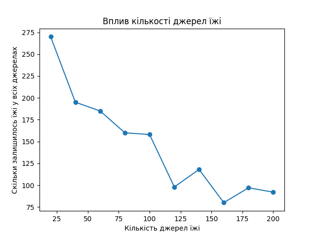
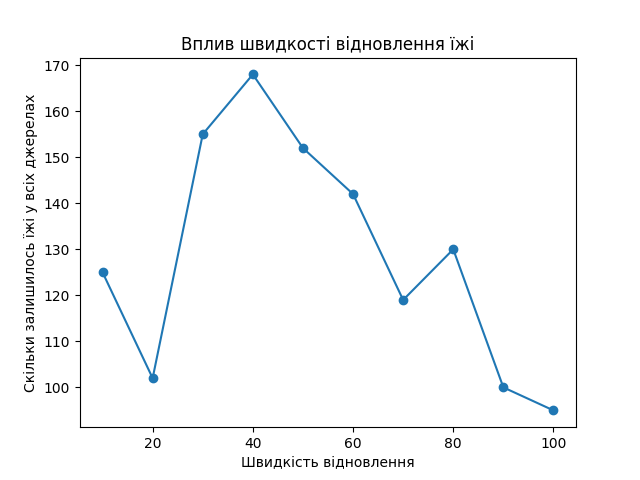

## Комп'ютерні системи імітаційного моделювання
## СПм-24-1, <Мальнєв Данило Максимович>
### Лабораторна робота №**1**. Опис імітаційних моделей та проведення обчислювальних експериментів

### Варіант 11, модель у середовищі NetLogo:
[Autumn](https://www.netlogoweb.org/launch#http://www.netlogoweb.org/assets/modelslib/Sample%20Models/Biology/Autumn.nlogo)

---

### Вербальний опис моделі:
Модель **Autumn** призначена для імітації процесів, що відбуваються в екосистемі упродовж осіннього періоду. Середовище моделі представлене у вигляді сітки, що складається з окремих ділянок (patches), на яких розміщуються джерела їжі та інші елементи екосистеми.

Час у моделі є дискретним і вимірюється у тактах. На кожному такті відбувається оновлення стану середовища, споживання та відновлення ресурсів. Модель дозволяє дослідити вплив керуючих параметрів на загальний стан екосистеми та залишок їжі у джерелах.

---

### Керуючі параметри:
До керуючих параметрів моделі належать параметри, значення яких задаються користувачем через інтерфейс NetLogo:

- **кількість джерел їжі** — визначає початкову кількість ресурсів у моделі  
- **швидкість відновлення їжі** — визначає, з якою швидкістю ресурси відновлюються з часом  
- **інтенсивність споживання** — впливає на швидкість використання ресурсів у середовищі  

Зміна цих параметрів дозволяє дослідити різні режими роботи екосистеми.

---

### Внутрішні параметри:
Внутрішні параметри моделі формуються автоматично в процесі симуляції:

- **кількість їжі на патчах** — відображає поточний стан ресурсів  
- **загальний залишок їжі** — агрегований показник усіх джерел  
- **стан середовища** — розподіл ресурсів у просторі  

Користувач не задає ці параметри безпосередньо, але вони визначають динаміку моделі.

---

### Показники роботи системи:
Основним показником роботи моделі є графік, що відображає:
- **скільки залишилось їжі у всіх джерелах**

Даний показник використовується для проведення обчислювальних експериментів.

---

### Недоліки моделі:
- Модель має стохастичний характер, тому результати можуть незначно відрізнятися між різними запусками.
- Обмежена кількість керуючих параметрів не дозволяє повністю описати реальну екосистему.
- Модель є спрощеною і не враховує всі фактори, притаманні природним екосистемам.

---

## Обчислювальні експерименти

### 1. Вплив кількості джерел їжі на залишок ресурсів
Досліджується залежність залишку їжі у всіх джерелах від початкової кількості джерел їжі.  
Тривалість кожної симуляції складає 400 тактів.

Інші керуючі параметри мають фіксовані значення.

<table>
<thead>
<tr><th>Кількість джерел їжі</th><th>Скільки залишилось їжі у всіх джерелах</th></tr>
</thead>
<tbody>
<tr><td>20</td><td>270</td></tr>
<tr><td>40</td><td>195</td></tr>
<tr><td>60</td><td>185</td></tr>
<tr><td>80</td><td>160</td></tr>
<tr><td>100</td><td>158</td></tr>
<tr><td>120</td><td>98</td></tr>
<tr><td>140</td><td>118</td></tr>
<tr><td>160</td><td>80</td></tr>
<tr><td>180</td><td>97</td></tr>
<tr><td>200</td><td>92</td></tr>
</tbody>
</table>

**Висновок:**  
Зі збільшенням кількості джерел їжі спостерігається тенденція до зменшення загального залишку ресурсів у середовищі, що пов’язано з інтенсивнішим споживанням.

---

### 2. Вплив швидкості відновлення їжі на залишок ресурсів
Досліджується залежність залишку їжі у всіх джерелах від швидкості відновлення ресурсів.  
Тривалість кожної симуляції складає 400 тактів.

<table>
<thead>
<tr><th>Швидкість відновлення</th><th>Скільки залишилось їжі у всіх джерелах</th></tr>
</thead>
<tbody>
<tr><td>10</td><td>125</td></tr>
<tr><td>20</td><td>102</td></tr>
<tr><td>30</td><td>155</td></tr>
<tr><td>40</td><td>168</td></tr>
<tr><td>50</td><td>152</td></tr>
<tr><td>60</td><td>142</td></tr>
<tr><td>70</td><td>119</td></tr>
<tr><td>80</td><td>130</td></tr>
<tr><td>90</td><td>100</td></tr>
<tr><td>100</td><td>95</td></tr>
</tbody>
</table>

**Висновок:**  
Зміна швидкості відновлення ресурсів суттєво впливає на залишок їжі у середовищі. Існує оптимальний діапазон значень, за якого система працює найбільш ефективно.

---

### 3. Вплив інтенсивності споживання на залишок ресурсів
Досліджується залежність залишку їжі у всіх джерелах від інтенсивності споживання.  
Тривалість кожної симуляції складає 400 тактів.

<table>
<thead>
<tr><th>Інтенсивність споживання</th><th>Скільки залишилось їжі у всіх джерелах</th></tr>
</thead>
<tbody>
<tr><td>10</td><td>108</td></tr>
<tr><td>20</td><td>120</td></tr>
<tr><td>30</td><td>170</td></tr>
<tr><td>40</td><td>185</td></tr>
<tr><td>50</td><td>182</td></tr>
<tr><td>60</td><td>192</td></tr>
<tr><td>70</td><td>150</td></tr>
<tr><td>80</td><td>162</td></tr>
<tr><td>90</td><td>165</td></tr>
<tr><td>100</td><td>150</td></tr>
</tbody>
</table>

**Висновок:**  
Зі збільшенням інтенсивності споживання загальний залишок їжі змінюється нелінійно, що свідчить про складну взаємодію процесів у моделі.

---

## Загальні висновки
У ході виконання лабораторної роботи було досліджено імітаційну модель **Autumn** у середовищі NetLogo. Проведені обчислювальні експерименти дозволили оцінити вплив керуючих параметрів на стан екосистеми та залишок ресурсів. Модель наочно демонструє динаміку споживання та відновлення ресурсів у спрощеній екосистемі.
